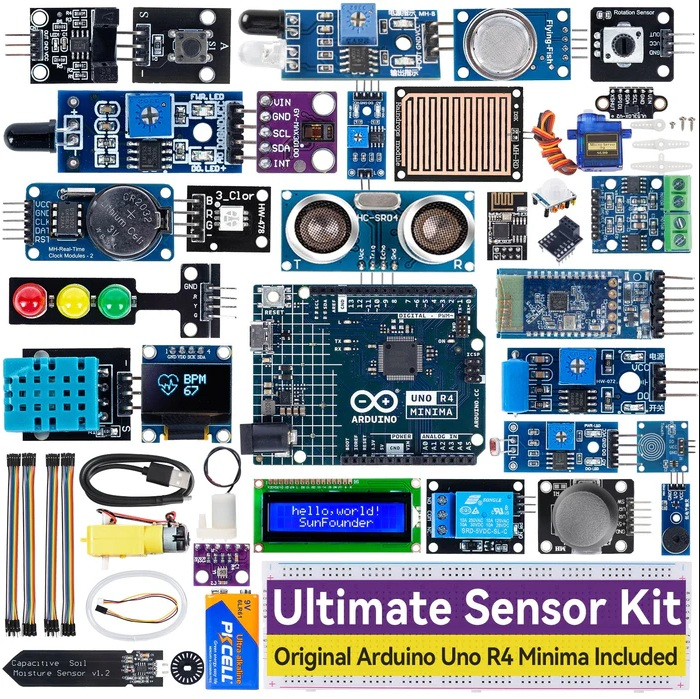
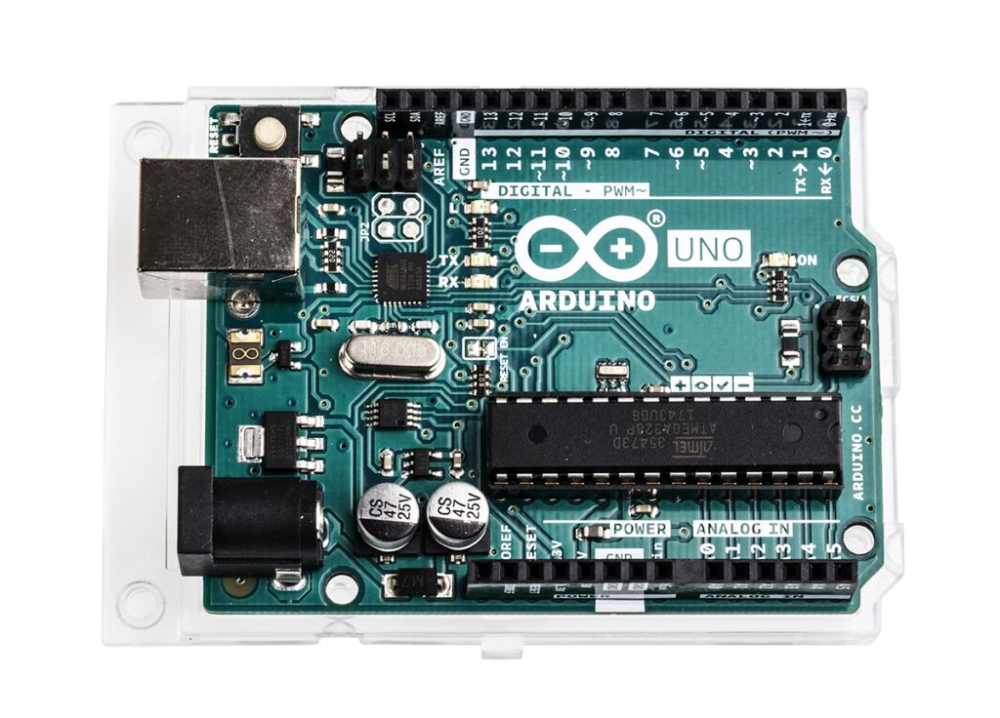
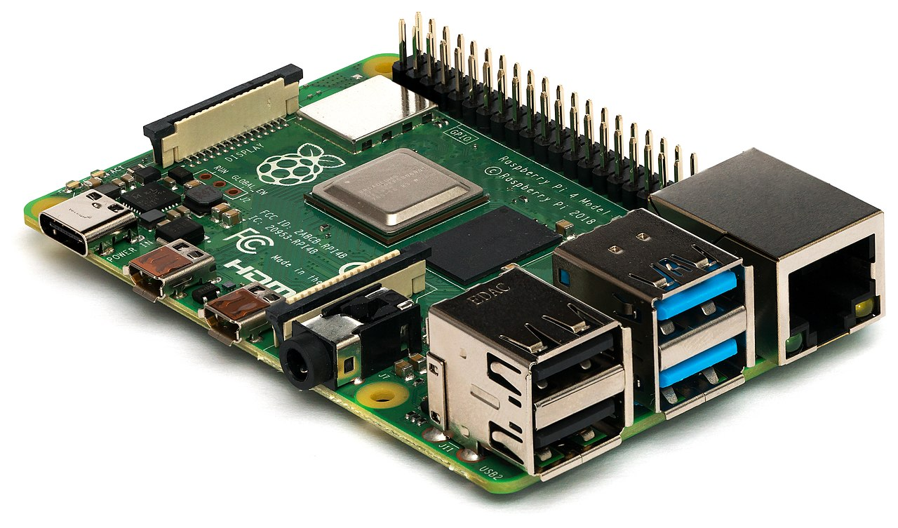

# Pertemuan 1: Pengenalan Sistem Tertanam dan Mikrokontroler

## Deskripsi Singkat

Mengenalkan konsep dasar sistem tertanam (Embedded Systems), perbedaan antara board mikrokontroler (Arduino) dan single-board computer (Raspberry Pi), serta penggunaan simulator Wokwi.

## Materi Pembelajaran

### 1. Apa itu Sistem Tertanam?



Sistem komputer yang dirancang khusus untuk fungsi tertentu dalam sistem mekanis atau elektrik yang lebih besar.

### 2. Arduino vs Raspberry Pi



- **Arduino**: Mikrokontroler, hemat daya, bare-metal, real-time.



- **Raspberry Pi**: OS (Linux), tinggi performa, multitasking.

---

## Contoh Studi Kasus & Solusi

### Contoh 1: Perbandingan Perangkat (Cerdas vs Pintar)

Sebutkan perbedaan mendasar antara mesin cuci otomatis dan Smart TV dari sisi sistem tertanam.

> [!TIP] **Jawaban/Solusi**
> Mesin cuci adalah **Sistem Tertanam** murni karena tugasnya spesifik (hanya mencuci), resource terbatas, dan tidak bisa diinstal aplikasi lain. Smart TV adalah **Sistem Komputer** karena memiliki OS (seperti Android TV/WebOS) yang mendukung multitasking dan instalasi aplikasi pihak ketiga.

### Contoh 2: Skenario Pemilihan Board

Perangkat mana yang lebih cocok untuk:

1. Sensor kelembaban tanah bertenaga baterai?
2. Sistem absensi pengenalan wajah (Face Recognition)?

> [!TIP] **Jawaban/Solusi**
>
> 1. **Arduino**: Karena konsumsi daya sangat rendah (Deep Sleep mode), cocok untuk sensor yang ditinggalkan di lapangan dengan baterai.
> 2. **Raspberry Pi**: Karena pengenalan wajah membutuhkan pengolahan citra berat (OpenCV) dan RAM yang besar yang hanya tersedia pada SBC.

### Contoh 3: Hello World di Simulator

Bagaimana cara memverifikasi bahwa simulator Wokwi siap digunakan?

> [!TIP] **Jawaban/Solusi**
> Pilih board "Arduino Uno", biarkan kode default (Blink) tetap ada, lalu klik tombol **Start Simulation**. Jika LED hijau (L) di board berkedip, maka simulator berfungsi normal.

---

## Praktikum Mandiri

**Tugas**: Buatlah sirkuit di Wokwi yang memiliki 1 LED, lalu ubah durasi hidupnya menjadi 3 detik dan matinya 1 detik.

> [!IMPORTANT] **Kunci Jawaban Praktikum**
> Ubah bagian `loop()` pada program menjadi:
>
> ```cpp
> void loop() {
>   digitalWrite(13, HIGH);
>   delay(3000); // 3 Detik Hidup
>   digitalWrite(13, LOW);
>   delay(1000); // 1 Detik Mati
> }
> ```
