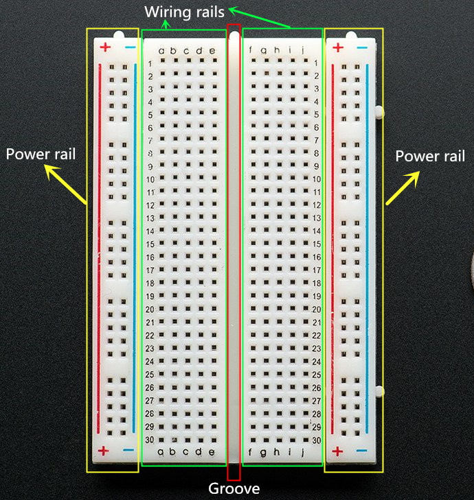
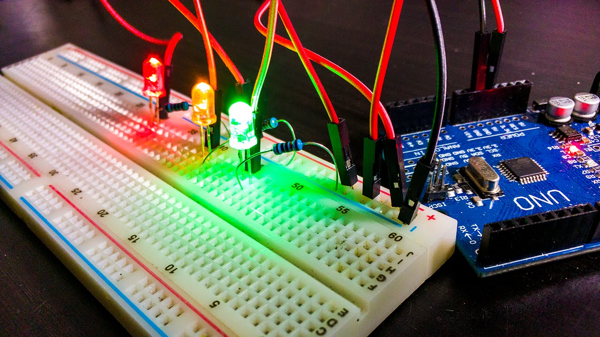

# Pertemuan 2: Pemrograman Dasar Arduino (Blink LED & Digital I/O)

## Materi Pembelajaran

---

### 0. Pengenalan Breadboard

#### Apa itu Breadboard?

**Breadboard** (atau _solderless breadboard_) adalah papan prototipe yang digunakan untuk merangkai sirkuit elektronik **tanpa memerlukan proses solder**. Sangat ideal untuk eksperimen dan pembelajaran karena komponen dapat dipasang dan dilepas dengan mudah.



#### Anatomi Breadboard

```
   a  b  c  d  e    f  g  h  i  j
   ┌──┬──┬──┬──┬──┐  ┌──┬──┬──┬──┬──┐
1  │  │  │  │  │  │  │  │  │  │  │  │
   ├──┼──┼──┼──┼──┤  ├──┼──┼──┼──┼──┤
2  │  │  │  │  │  │  │  │  │  │  │  │
   ├──┼──┼──┼──┼──┤  ├──┼──┼──┼──┼──┤
3  │  │  │  │  │  │  │  │  │  │  │  │
   └──┴──┴──┴──┴──┘  └──┴──┴──┴──┴──┘
   ════════════════════════════════  (+) Rail Merah (Power)
   ════════════════════════════════  (–) Rail Biru  (Ground)
```

| Bagian                     | Deskripsi                                                                                                            |
| -------------------------- | -------------------------------------------------------------------------------------------------------------------- |
| **Terminal Strips**        | Baris lubang di tengah (a–e dan f–j). **Terhubung secara horizontal** dalam satu baris (1a–1e adalah satu jalur)     |
| **Power Rails**            | Dua jalur panjang di sisi atas/bawah. **Terhubung secara vertikal** sepanjang papan. Merah = VCC (+), Biru = GND (–) |
| **Celah Tengah (DIP Gap)** | Pemisah antara dua sisi terminal. Dirancang untuk IC/chip                                                            |

#### Aturan Koneksi Breadboard

> [!IMPORTANT] **Perlu Diingat**
>
> - Lubang **a, b, c, d, e** dalam **baris yang sama** → **TERHUBUNG** (satu jalur)
> - Lubang di **baris berbeda** → **TIDAK terhubung** (jalur terpisah)
> - Lubang di sisi kiri (a–e) dan sisi kanan (f–j) **dipisahkan oleh celah tengah** → **TIDAK terhubung**
> - Rail merah (+) dan biru (–) di sisi atas dan bawah adalah jalur **terpisah** (harus dihubungkan jika ingin satu power rail)

#### Komponen Dasar yang Sering Digunakan di Breadboard

| Komponen         | Simbol  | Fungsi                                                                    |
| ---------------- | ------- | ------------------------------------------------------------------------- |
| **LED**          | 🔴      | Indikator cahaya (anoda = kaki panjang ke +, katoda = kaki pendek ke GND) |
| **Resistor**     | ─────── | Membatasi arus agar LED tidak terbakar                                    |
| **Push Button**  | ─[ ]─   | Tombol sementara (NO = Normally Open)                                     |
| **Kabel Jumper** | ~~~~~~  | Menghubungkan titik-titik di breadboard ke Arduino                        |

#### Cara Merangkai LED + Resistor ke Arduino

**Skema Koneksi:**

```
Arduino Pin 13 ──► Resistor 220Ω ──► Anoda LED (+)
                                         Katoda LED (–) ──► GND Arduino
```

**Langkah di Breadboard:**

1. Pasang **kaki panjang LED** (anoda) di lubang, misal `e5`.
2. Pasang **kaki pendek LED** (katoda) di `e6`.
3. Hubungkan **kaki katoda** ke **rail GND** (biru) dengan kabel jumper.
4. Pasang **satu kaki resistor 220Ω** di lubang `d5` (satu jalur dengan anoda LED).
5. Pasang **kaki resistor lainnya** di lubang berbeda, misal `b5`.
6. Gunakan kabel jumper dari `a5` ke **pin 13 Arduino**.

> [!NOTE] **Mengapa Perlu Resistor?**
> LED beroperasi pada tegangan ~2V, sedangkan Arduino mengeluarkan 5V. Tanpa resistor, arus berlebih akan **merusak (membakar) LED**. Resistor 220Ω–1kΩ umumnya digunakan untuk LED standar.

#### Cara Merangkai Push Button ke Arduino

**Skema (INPUT_PULLUP):**

```
Arduino Pin 2 ──► Kaki tombol A
                  Kaki tombol B ──► GND Arduino
```

Dengan mode `INPUT_PULLUP`, nilai default pin = **HIGH**. Saat tombol ditekan, pin menjadi **LOW**.

---

### 1. Struktur Sketch

- `setup()`: Inisialisasi (dijalankan 1×).
- `loop()`: Eksekusi berulang terus-menerus.

### 2. Fungsi Digital I/O

- `pinMode(pin, mode)` — Atur pin sebagai `INPUT`, `OUTPUT`, atau `INPUT_PULLUP`.
- `digitalWrite(pin, value)` — Keluarkan `HIGH` (5V) atau `LOW` (0V).
- `digitalRead(pin)` — Baca nilai `HIGH` atau `LOW` dari pin input.

---

## Contoh Studi Kasus & Solusi

### Contoh 1: SOS Morse Signal

Bagaimana cara membuat sinyal SOS (... --- ...) pada LED internal pin 13?

> [!TIP] **Jawaban/Solusi**
>
> ```cpp
> void kedip(int durasi) {
>   digitalWrite(13, HIGH);
>   delay(durasi);
>   digitalWrite(13, LOW);
>   delay(durasi);
> }
>
> void loop() {
>   for(int i=0; i<3; i++) { kedip(200); } // S
>   delay(200);
>   for(int i=0; i<3; i++) { kedip(600); } // O
>   delay(200);
>   for(int i=0; i<3; i++) { kedip(200); } // S
>   delay(2000); // Jeda antar sinyal
> }
> ```

### Contoh 2: Toggle LED with Button

Buatlah logika agar LED berubah status (ON ke OFF atau sebaliknya) setiap kali tombol ditekan sekali.

> [!TIP] **Jawaban/Solusi**
>
> ```cpp
> const int btn = 2;
> const int led = 13;
> bool state = false;
>
> void setup() {
>   pinMode(btn, INPUT_PULLUP);
>   pinMode(led, OUTPUT);
> }
>
> void loop() {
>   if (digitalRead(btn) == LOW) {
>     state = !state;
>     digitalWrite(led, state);
>     while(digitalRead(btn) == LOW); // Menunggu tombol dilepas (Latch)
>     delay(50); // Debounce
>   }
> }
> ```

### Contoh 3: Traffic Light Simulator



Sebutkan urutan pin dan delay yang umum digunakan untuk simulasi lampu lalu lintas.

> [!TIP] **Jawaban/Solusi**
> Pin 8 (Merah), Pin 9 (Kuning), Pin 10 (Hijau).
> Urutan: Merah (5 detik) -> Kuning (1 detik) -> Hijau (5 detik) -> Kuning (2 detik) -> Ulang.

---

## Praktikum Mandiri

**Tugas**: Buatlah program agar LED hanya menyala jika Dua Tombol (pin 2 dan 3) ditekan secara bersamaan (Logika AND).

> [!IMPORTANT] **Kunci Jawaban Praktikum**
>
> ```cpp
> void loop() {
>   if (digitalRead(2) == LOW && digitalRead(3) == LOW) {
>     digitalWrite(13, HIGH);
>   } else {
>     digitalWrite(13, LOW);
>   }
> }
> ```

---

## Referensi Video

### 🎬 Pengenalan Breadboard & Rangkaian LED Arduino

▶️ [Tonton di YouTube](https://youtu.be/fq6U5Y14oM4?si=jBqQ1UZqjUXsnnwv)

<iframe width="560" height="315" src="https://www.youtube.com/embed/fq6U5Y14oM4?si=jBqQ1UZqjUXsnnwv" title="YouTube video player" frameborder="0" allow="accelerometer; autoplay; clipboard-write; encrypted-media; gyroscope; picture-in-picture; web-share" referrerpolicy="strict-origin-when-cross-origin" allowfullscreen></iframe>
