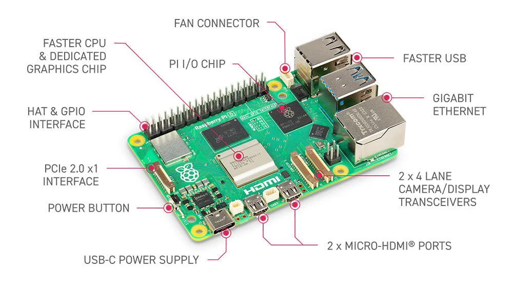

# Pertemuan 4: Pemrograman Raspberry Pi dan GPIO Dasar

## Materi Pembelajaran

---

### 1. Apa itu Raspberry Pi?

**Raspberry Pi** adalah komputer papan tunggal (_Single Board Computer / SBC_) berukuran kecil yang dikembangkan oleh **Raspberry Pi Foundation** (Inggris) sejak tahun 2012. Dirancang awalnya untuk pendidikan, kini Raspberry Pi digunakan secara luas di industri, riset, dan proyek DIY.

Raspberry Pi menjalankan **Sistem Operasi** berbasiskan Linux (umumnya **Raspberry Pi OS** / Raspbian), sehingga mampu menjalankan program layaknya komputer biasa — menjalankan browser, menulis kode, memutar video, dan terhubung ke internet.



> [!NOTE] **Raspberry Pi Bukan Mikrokontroler**
> Raspberry Pi adalah **Mini-PC**, sedangkan Arduino adalah **Mikrokontroler**. Ini adalah perbedaan mendasar yang menentukan bagaimana masing-masing diprogram dan dioperasikan.

---

### 2. Perbedaan Raspberry Pi vs Arduino

| Aspek                  | Arduino Uno                         | Raspberry Pi 4                   |
| ---------------------- | ----------------------------------- | -------------------------------- |
| **Tipe**               | Mikrokontroler                      | Single Board Computer (Mini-PC)  |
| **Prosesor**           | ATmega328P (8-bit, 16 MHz)          | ARM Cortex-A72 (64-bit, 1.8 GHz) |
| **RAM**                | 2 KB                                | 2/4/8 GB                         |
| **Sistem Operasi**     | Tidak ada (bare-metal)              | Linux (Raspberry Pi OS, Ubuntu)  |
| **Bahasa Pemrograman** | C/C++ (Arduino IDE)                 | Python, C++, Java, Node.js, dll. |
| **Koneksi**            | USB (Serial)                        | WiFi, Bluetooth, Ethernet, USB   |
| **Port HDMI**          | ❌ Tidak ada                        | ✅ Ada (output layar)            |
| **Pin GPIO**           | 14 Digital I/O + 6 Analog           | 40 GPIO (semuanya Digital)       |
| **Konsumsi Daya**      | ~50 mA (sangat hemat)               | ~600 mA – 3A (lebih boros)       |
| **Harga (estimasi)**   | Rp 100.000 – 200.000                | Rp 800.000 – 1.500.000           |
| **Cocok untuk**        | Kontrol real-time, sensor, aktuator | Pengolahan data, AI, web, kamera |

> [!TIP] **Kapan Pilih Arduino?**
> Gunakan Arduino jika proyek Anda membutuhkan: kontrol aktuator real-time, berjalan tanpa OS, hemat daya (baterai), atau harga sangat terbatas.

> [!TIP] **Kapan Pilih Raspberry Pi?**
> Gunakan Raspberry Pi jika proyek Anda membutuhkan: koneksi internet, antarmuka layar, pengolahan citra (OpenCV), machine learning, atau menjalankan web server.

---

### 3. Kelebihan Raspberry Pi

| No  | Kelebihan                 | Penjelasan                                                                      |
| --- | ------------------------- | ------------------------------------------------------------------------------- |
| 1   | **Komputer Lengkap**      | Dapat dihubungkan ke monitor via HDMI, keyboard, dan mouse seperti PC biasa     |
| 2   | **Multitasking**          | Mampu menjalankan banyak program sekaligus (browser + kode + server)            |
| 3   | **Konektivitas Kaya**     | WiFi 5GHz, Bluetooth 5.0, Gigabit Ethernet, 4x USB, GPIO 40-pin                 |
| 4   | **Mendukung Python**      | Python adalah bahasa utama RPi, dengan ekosistem library yang sangat luas       |
| 5   | **Kamera Support**        | Mendukung modul kamera resmi Raspberry Pi dan WebCam USB untuk pengolahan citra |
| 6   | **Bisa Jadi Server**      | Dapat menjalankan Web Server (Apache/Nginx), Database (MySQL), API, IoT Hub     |
| 7   | **Machine Learning & AI** | Mampu menjalankan TensorFlow Lite, OpenCV, Edge Impulse                         |
| 8   | **Komunitas Besar**       | Jutaan pengguna di seluruh dunia, dokumentasi sangat lengkap                    |
| 9   | **GPIO 40 Pin**           | Bisa mengontrol sensor dan aktuator seperti Arduino, namun lebih powerful       |
| 10  | **Harga Terjangkau**      | Relatif murah dibanding SBC lain dengan spesifikasi serupa                      |

---

### 4. Proyek yang Bisa Dibuat dengan Raspberry Pi

#### 🏠 Smart Home & IoT

- **Sistem CCTV Rumah** — Rekam video dari kamera, simpan ke cloud, akses via smartphone
- **Smart Doorbell** — Deteksi wajah tamu lewat kamera + notifikasi WhatsApp
- **Home Automation Hub** — Kontrol lampu, AC, kipas via suara atau aplikasi
- **Pemantau Energi Listrik** — Monitor konsumsi daya real-time dan log ke database

#### 🤖 Robotika & Otomasi

- **Robot Navigasi Otonom** — Robot yang bisa menghindari rintangan dengan kamera + OpenCV
- **Drone Controller** — Raspberry Pi sebagai flight controller berbasis kamera
- **Conveyor Sorting Robot** — Deteksi warna objek pada ban berjalan pabrik

#### 🧠 Kecerdasan Buatan (AI)

- **Face Recognition Attendance** — Sistem absensi otomatis mengenali wajah karyawan
- **Object Detection (YOLOv5)** — Deteksi kendaraan, manusia, hewan secara real-time
- **Voice Assistant Lokal** — Asisten suara berbasis Vosk (offline, tanpa internet)
- **Plant Disease Detector** — Kamera mendeteksi penyakit daun tanaman via TensorFlow

#### 🌐 Server & Jaringan

- **Web Server Lokal (LAMP)** — Hosting website/aplikasi Laravel di jaringan kampus
- **Ad Blocker (Pi-hole)** — Blokir iklan di seluruh jaringan rumah
- **VPN Server** — Akses jaringan kantor dari luar secara aman
- **NAS (Network Attached Storage)** — Penyimpanan file jaringan bersama

#### 📡 Pemantau & Sensor

- **Weather Station** — Monitor suhu, kelembaban, tekanan udara, unggah ke web
- **Air Quality Monitor** — Deteksi PM2.5, CO2, kirim grafik ke Telegram
- **Earthquake Alert System** — Sensor seismik terhubung ke notifikasi WhatsApp

#### 🎮 Media & Hiburan

- **Retro Gaming Console** — Emulator Game Boy, SNES, PS1 via RetroPie
- **Media Center** — Pemuar film & musik seluruh rumah (Kodi)
- **Digital Signage** — Layar informasi/iklan otomatis di lobi kantor

---

## Contoh Studi Kasus & Solusi

### Contoh 1: Python Blink LED

Apa perbedaan utama mengontrol LED di Arduino vs Raspberry Pi (Python)?

> [!TIP] **Jawaban/Solusi**
> Di Arduino, kode di-compile menjadi biner dan berjalan langsung di hardware. Di Raspberry Pi, kode berjalan di atas Sistem Operasi Linux. Contoh Python menggunakan `gpiozero`:
>
> ```python
> from gpiozero import LED
> led = LED(17)
> led.blink()
> ```

### Contoh 2: Shutdown Button

Bagaimana membuat tombol fisik untuk mematikan OS Raspberry Pi dengan aman?

> [!TIP] **Jawaban/Solusi**
> Menghubungkan tombol ke GPIO dan menjalankan perintah sistem `poweroff`.
>
> ```python
> from gpiozero import Button
> from os import system
> btn = Button(2)
> btn.when_pressed = lambda: system("sudo poweroff")
> ```

### Contoh 3: CPU Temperature Monitoring

Mengapa suhu CPU Raspberry Pi perlu dipantau secara rutin?

> [!TIP] **Jawaban/Solusi**
> Untuk mencegah _thermal throttling_ (penurunan performa akibat panas). Dapat dicek via perintah terminal `vcgencmd measure_temp` atau membaca file `/sys/class/thermal/thermal_zone0/temp`.

---

## Praktikum Mandiri

**Tugas**: Buatlah skrip Python yang mencatat waktu (timestamp) setiap kali tombol ditekan ke dalam sebuah file `log.txt`.

> [!IMPORTANT] **Kunci Jawaban Praktikum**
>
> ```python
> from gpiozero import Button
> from datetime import datetime
>
> btn = Button(21)
> while True:
>     btn.wait_for_press()
>     with open("log.txt", "a") as f:
>         f.write(f"Ditekan pada: {datetime.now()}\n")
> ```
